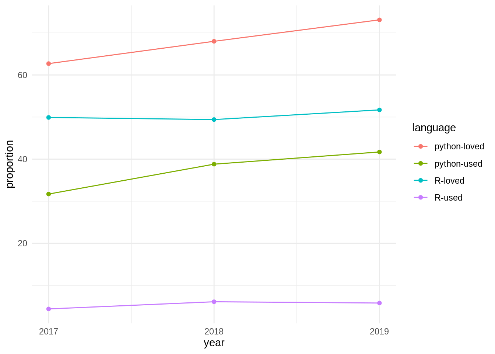

# (APPENDIX) Appendix {-}

# Notes on Scope and the Python Statistical Ecosystem {#python}

Two factors may be usefully noted in this regard:

1. The potential number of python packages for statistical analyses is likely
   to be relatively more restricted than relative numbers of **R** packages.
   Taking as indicative presentations at the previous three Joint Statistical
   Meetings (JSMs; 2018-2020), no python packages were referred to in any
   abstract, while 32 **R** packages were presented, along with two
   meta-platforms for **R** packages. Presentations at the Symposium of Data
   Science and Statistics (SDSS) for 2018-19 similarly including numerous
   presentations of **R** packages, along with presentation of
   [three](https://altair-viz.github.io)
   [python](https://github.com/ajboyd2/salmon)
   [packages](https://github.com/dlsun/symbulate). It may accordingly be
   expected that potential expansion to include python packages will demand
   relatively very little time or effort compared with that devoted to **R**
   packages as the primary software scope.
2. In spite of the above, the community of python users is enormously greater,
   reflected in the currently 232,161 packages compared with
   15,576 packages on CRAN, or over 14 times as
   many python packages. Similarly, 41.7% of all respondents to the [2019
   stackoverflow developer
   survey](https://insights.stackoverflow.com/survey/2019) nominated python as
   their most popular language, compared with only 5.8% who nominated **R**.

The relative importance of python is powerfully reflected in temporal trends
from the [stackoverflow developer
survey](https://insights.stackoverflow.com/survey/2019) from the previous three
years, with results shown in the following graphic.

Python is not only more used and more loved than **R**, but both statistics for
python have consistently grown at a faster rate over the past three years as
have equivalent statistics for **R**.

Both languages nevertheless have relative well-defined standards for software
packaging, python via the [Python Package Index
(pypi)](https://packaging.python.org/tutorials/packaging-projects), and **R**
via [CRAN](https://cran.r-project.org). In contrast to CRAN, which runs its own
checks on all packages on a daily basis, there are no automatic checks for
[pypi](https://packaging.python.org/tutorials/packaging-projects) packages, and
almost any form of package that minimally conforms to the standards may be
submitted. This much lower effective barrier to entry likely partially
contributes to the far greater numbers of
[pypi](https://packaging.python.org/tutorials/packaging-projects) 
(232,161) than
[CRAN](https://cran.r-project.org) (15,576) packages.

## Analysis of statistical software keywords {#appendix-keywords}

The
[JOSS](https://joss.theoj.org)
conducts its own peer review process, and publishes textual descriptions of
accepted software. Each piece of software then has its own web page on the
journal's site, on which the text is presented as a compiled `.pdf`-format
document, along with links to the open review, as well as to the software
repository. The published document must be included within the software
repository in a file named `paper.md`, which enables automatic extraction and
analysis of these text descriptions of software. Rather than attempt
a comprehensive, and unavoidably subjective, categorization of software, these
textual descriptions were used to identify key words or phrases (hereafter,
"keywords") which encapsulated the purpose, function, or other general
descriptive elements of each piece of software. Each paper generally yielded
multiple keywords. Extracting these from all papers judged to be potentially in
scope allowed for the construction of a network of topics, in which the nodes
were the key words and phrases, and the connections between any pair of nodes
reflected the number of times those two keywords co-occured across all papers.

We extracted all papers accepted and published by JOSS (217 at the time of
writing in early 2020), and manually determined which of these were broadly
statistical, reducing the total to 92. We then read through the contents of
each of these, and recorded as many keywords as possible for each paper. The
resultant network is shown in the following interactive graphic, in which nodes
are scaled by numbers of occurrences, and edges by numbers of co-occurrences.
(Or [click
here](https://ropenscilabs.github.io/statistical-software/abstracts/network-terms/index.html)
for full-screen version with link to code.)

<!--html_preserve-->

<!--/html_preserve-->

Such a network visualization enables immediate identification of more and less
central concepts including, in our case, several that we may not otherwise have
conceived of as having been potentially in scope. We then used this network to
define our set of key "in scope" concepts. This figure also reveals that many
of these keywords are somewhat "lower level" than the kinds of concepts we
might otherwise have used to define scoping categories. For example, keywords
such as "likelihood" or "probability" are not likely to be useful in defining
actual categories of statistical software, yet they turned out to lie at the
centres of relatively well-defined groups of related keywords.

We also examined the forms of both input and output data for each of the 92
pieces of software described in these JOSS papers, and constructed [an
additional
graph](https://ropenscilabs.github.io/statistical-software/abstracts/network-io/index.html)
directionally relating these different data formats.

<!--html_preserve-->

<!--/html_preserve-->

## Bibliography
